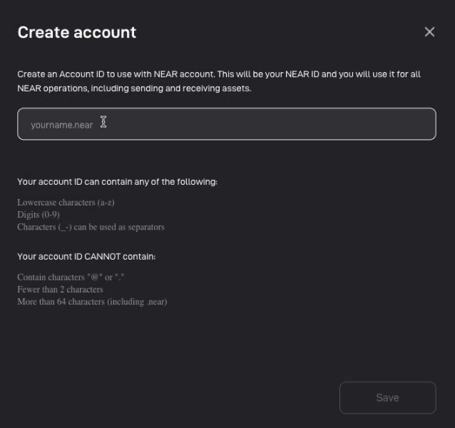

# Sign in

## **Sign in with a NEAR wallet**

<figure><figcaption></figcaption></figure>

1. Click on the first option for wallets on NEAR Blockchain.
2. Choose the wallet you wish to use and sign in. Popula now supports the following wallets.
   * NEAR Wallet
   * Meteor Wallet
   * Mintbase Wallet
   * MyNearWallet
   * Near Mobile Wallet
   * Here Wallet
   * Sender

<figure><figcaption></figcaption></figure>

You will then be asked to connect your wallet with limited permissions (Popula is not yet allowed to transfer any tokens). Once connected, you will automatically be logged in to Popula.

## **Sign in with a Metamask wallet**

1. Choose Metamask.&#x20;
2.  Approve the sign-in request

     (1).png>)
3.  Upon signing in, enter an account address for your NEAR wallet that is going to be created. (There's a NEAR wallet created when logging in via Metamask wallet for the first time, and your EVM account is linked with the NEAR account created.)

    <figure><figcaption></figcaption></figure>
4.  Personalize your profile by adding a captivating profile photo and a cool name. You can also[ select an NFT from your assets to be your unique profile image](set-up-profile.md#profile-picture).

    <figure><figcaption></figcaption></figure>
5. Then you'll be able to enjoy a smooth gasless experience in Popula communities with [Visitor Mode](visitor-mode.md).&#x20;
6.  Be sure to export and keep your private key safe! You can always export your private keys or check your NEAR account here on your Profile Page.

    <figure><figcaption></figcaption></figure>

> :bulb: Popula supports the creation of a **non-custodial** NEAR wallet through Metamask login, powered by [**Lit Protocol**](https://litprotocol.com/).

## If you don't have any wallet

1.  Mark the checkbox below and choose NEAR wallet selector.

    <figure><figcaption></figcaption></figure>
2.  Click on "Get a Wallet".

    <figure><figcaption></figcaption></figure>
3.  Select a wallet dapp of your choice, and follow the instructions provided on the wallet dapp to create your wallet.

    <figure><figcaption></figcaption></figure>
4. Follow the steps [here](sign-in.md#sign-in-with-a-near-wallet) and log in via your newly created wallets.&#x20;

Awesome! Now that you have logged in, it's time to start exploring all the brilliant communities on Popula or… even go ahead and create your own!😊
